# 🔐 Implementazione Validazione Automatica Sessione

## 📋 Panoramica

È stata implementata una logica di validazione automatica della sessione che risolve il problema descritto: **ad ogni caricamento pagina viene verificato se la sessione è ancora attiva, e viene effettuato il logout automatico SOLO se la sessione non è più valida**.

## 🎯 Problema Risolto

**Prima**: L'utente rimaneva "loggato" anche se la sessione era scaduta, costringendolo a fare logout manualmente.

**Dopo**: Il sistema verifica automaticamente la validità della sessione e fa logout automatico solo quando necessario.

## 🏗️ Architettura Implementata

### 1. Backend - Endpoint di Validazione

**File**: `backend/app.py`
**Endpoint**: `/api/auth/validate-session`

```python
@app.route('/api/auth/validate-session', methods=['GET'])
@jwt_required()
def validate_session():
    """Validate if the current JWT session is still valid"""
    current_user_id = get_jwt_identity()
    
    # Verifica che l'utente esista ancora nel database
    # Controlla se l'account è stato disattivato
    # Restituisce lo stato della sessione
```

**Funzionalità**:
- Verifica che l'utente esista ancora nel database
- Controlla lo stato dell'account
- Restituisce informazioni sulla validità della sessione

### 2. Frontend - Proxy Endpoint

**File**: `frontend/app.py`
**Endpoint**: `/api/auth/validate-session`

```python
@app.route('/api/auth/validate-session', methods=['GET'])
def api_validate_session():
    """Proxy per validare la sessione corrente"""
    if not is_authenticated():
        return jsonify({'error': 'Autenticazione richiesta'}), 401
    
    result = call_backend('/api/auth/validate-session', 'GET', auth_token=session['session_token'])
    return jsonify(result or {'error': 'Backend non disponibile'})
```

### 3. Template Base - JavaScript di Validazione

**File**: `frontend/templates/base.html`

```javascript
// Verifica automatica della sessione
async function checkSessionValidity() {
    try {
        const response = await fetch('/api/auth/validate-session');
        if (response.ok) {
            const data = await response.json();
            if (!data.success || !data.session_valid) {
                await performLogout();
            }
        } else if (response.status === 401) {
            await performLogout();
        }
    } catch (error) {
        console.error('Error checking session validity:', error);
    }
}

// Logout automatico
async function performLogout() {
    try {
        localStorage.removeItem('access_token');
        localStorage.removeItem('session_token');
        await fetch('/api/auth/logout', { method: 'POST' });
        window.location.href = '/login';
    } catch (error) {
        window.location.href = '/login';
    }
}
```

## ⏰ Timing di Verifica

### 1. Caricamento Pagina
- **Quando**: Ad ogni `DOMContentLoaded`
- **Frequenza**: Una volta per caricamento

### 2. Controllo Periodico
- **Quando**: Ogni 5 minuti
- **Frequenza**: `setInterval(checkSessionValidity, 5 * 60 * 1000)`

### 3. Cambio Visibilità
- **Quando**: Quando l'utente torna alla pagina
- **Evento**: `visibilitychange` (non document.hidden)

### 4. Richieste API
- **Quando**: Ad ogni richiesta API che restituisce 401
- **Azione**: Logout automatico immediato

## 🔄 Flusso di Funzionamento

```mermaid
graph TD
    A[Caricamento Pagina] --> B[Verifica Sessione]
    B --> C{Sessione Valida?}
    C -->|Sì| D[Continua Normalmente]
    C -->|No| E[Logout Automatico]
    E --> F[Redirect a /login]
    
    G[Controllo Periodico] --> B
    H[Cambio Visibilità] --> B
    I[Errore 401 API] --> E
```



## 🛡️ Gestione Errori

### 1. Errori di Rete
- **Comportamento**: Non fa logout automatico per evitare falsi positivi
- **Log**: Errore registrato in console

### 2. Backend Non Disponibile
- **Comportamento**: Non fa logout automatico
- **Fallback**: Continua con la sessione esistente

### 3. Sessione Scaduta
- **Comportamento**: Logout automatico immediato
- **Azione**: Pulizia localStorage + redirect

## 📊 Vantaggi dell'Implementazione

### ✅ Sicurezza
- Verifica automatica della validità della sessione
- Logout automatico quando necessario
- Prevenzione accessi non autorizzati

### ✅ User Experience
- Nessun intervento manuale richiesto
- Transizione fluida al login
- Nessuna perdita di dati

### ✅ Performance
- Verifica asincrona non bloccante
- Controllo intelligente (solo quando necessario)
- Pulizia automatica delle risorse

### ✅ Manutenibilità
- Codice centralizzato e riutilizzabile
- Logging dettagliato per debug
- Gestione errori robusta

## 🧪 Test

Per testare l'implementazione:

```bash
python3 test_session_validation.py
```

Il test verifica:
- Presenza degli endpoint
- Corretta implementazione JavaScript
- Gestione degli errori

## 🔧 Configurazione

### Intervallo di Verifica
Per modificare l'intervallo di verifica periodica, editare in `frontend/templates/base.html`:

```javascript
// Cambia da 5 minuti a X minuti
sessionCheckInterval = setInterval(checkSessionValidity, X * 60 * 1000);
```

### Endpoint di Validazione
L'endpoint può essere esteso per includere controlli aggiuntivi:

```python
# Esempi di controlli aggiuntivi
- Verifica ultimo accesso
- Controllo stato account (attivo/inattivo)
- Verifica permessi utente
- Controllo IP di accesso
```

## 📝 Note Tecniche

### JWT Token
- I token JWT sono stateless
- La validazione verifica l'esistenza dell'utente nel database
- Non è necessario invalidare token lato server

### Session Storage
- Utilizza sia session storage (Flask) che localStorage (JavaScript)
- Pulizia automatica di entrambi durante il logout

### CORS
- Configurato per supportare richieste cross-origin
- Credenziali incluse nelle richieste

## 🚀 Deployment

L'implementazione è pronta per il deployment e non richiede configurazioni aggiuntive. Tutti i file sono stati aggiornati e testati per la compatibilità.

## 📞 Supporto

Per problemi o domande sull'implementazione, consultare:
- Log del browser (Console JavaScript)
- Log del backend (Python)
- Test script incluso